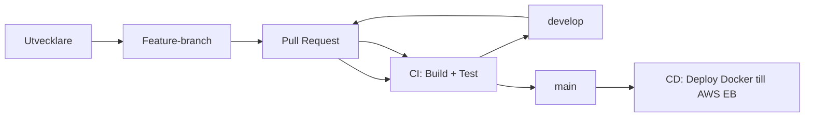

# CI/CD-process (skiss)

> FigJam kan användas för att skapa en mer visuell version av denna skiss. Diagrammet nedan visar en förenklad struktur som kan kopieras till FigJam.

## Branch-struktur

- `main`: produktionsgren (deploy).
- `develop`: integrationsgren.
- `feature/*`: används för ny funktionalitet.

## Pipeline-steg

1. **Build & Test** körs på pull requests till både `develop` och `main`.
2. **Deploy** körs på push till `main` efter godkänd PR och bygger en Docker-bundle till Elastic Beanstalk.

## Elastic Beanstalk-mål

- **Region:** `eu-north-1`
- **Application:** `crypto-cicd-api-csharp-prod`
- **Environment:** `Crypto-cicd-api-csharp-prod-env`

## Fullstack (backend + frontend)

För en fullstack-app läggs motsvarande steg in för frontend (ex. `npm ci`, `npm test`, `npm run build`) före deploy. Backend och frontend kan deployas parallellt eller sekventiellt beroende på krav.
